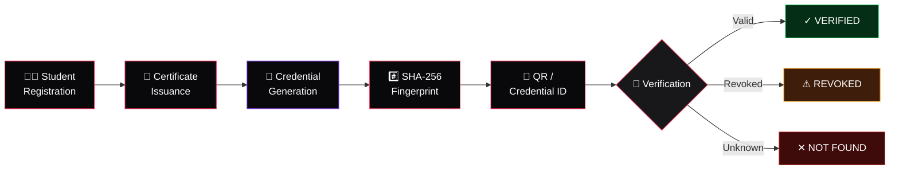
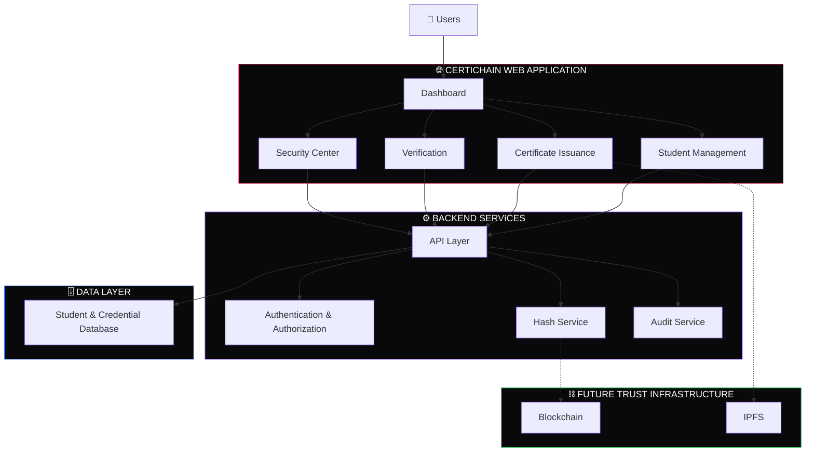
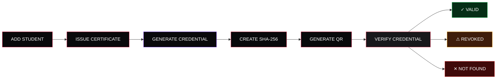

<div align="center">


<br/>


<br/><br/>

<a href="https://decerti-chain-client.vercel.app">

</a>

  

<a href="https://github.com/Arijit07-tech7/CertiChain">

</a>

<br/><br/>


&nbsp;

&nbsp;

&nbsp;


</div>

---

<div align="center">

# 🔐 CertiChain

### **Digital Credential Trust Infrastructure**

A secure digital platform for **issuing, managing and verifying academic credentials** with cryptographic integrity, QR-based verification and an architecture designed for future blockchain integration.

<br/>

> **Issue securely. Verify instantly. Trust digitally.**

</div>

---

## ⚡ Quick Access

<div align="center">

<a href="https://decerti-chain-client.vercel.app">

</a>

  

<a href="https://github.com/Arijit07-tech7/CertiChain">

</a>

<br/><br/>

**Student → Credential → Fingerprint → QR → Verification**

</div>

---

## ✦ Why CertiChain?

Traditional academic certificates are often distributed as static documents, making fast and reliable authenticity checks difficult.

**CertiChain** introduces a digital credential lifecycle designed around **identity, integrity, verification and trust**.

### The platform enables credentials to be:

* 👨‍🎓 **Issued** through a structured institutional workflow
* 🔐 **Fingerprint-protected** using SHA-256
* 🆔 **Assigned** a unique credential identity
* 📱 **Verified** through QR or Credential ID
* 🚫 **Revoked** when required
* 🧾 **Tracked** through audit events
* ⛓️ **Extended** toward blockchain and decentralized storage

<br/>

<div align="center">

> ### **Make credentials easy to verify — while keeping the trust infrastructure behind the scenes.**

</div>

---

## 🔄 Credential Verification Flow



---

# ✨ Core Capabilities

## 👨‍🎓 Student Management

Maintain structured student records containing:

**Name • Student ID • Department • Course • Batch • Email • Graduation Year**

---

## 📜 Certificate Issuance

Generate formal academic certificates using verified student information and credential metadata.

---

## 🔐 SHA-256 Credential Fingerprinting

CertiChain can generate a deterministic cryptographic fingerprint from credential data.

This fingerprint helps identify whether the underlying credential payload has changed.

---

## 📱 QR-Based Verification

Every credential can be connected to a digital verification experience through a QR code.

**Scan → Identify → Verify → Trust**

---

## 🔎 Instant Credential Verification

A verifier can check a credential using:

```text
Credential ID
      ↓
QR Code
      ↓
Verification Engine
      ↓
Verification Result
```

Possible states:

**🟢 VERIFIED**
**🟠 REVOKED**
**🔴 NOT FOUND**

---

## 🚫 Revocation Registry

Issued credentials can be marked as revoked while preserving their credential identity and lifecycle history.

This provides a structured mechanism for handling invalidated credentials.

---

## 🧾 Audit Trail

Important credential lifecycle operations can be represented through structured audit events.

Examples include:

* Student registration
* Credential issuance
* Verification
* Revocation
* Administrative operations

---

## 🖨️ Print & PDF Experience

Certificates are designed as **formal institutional documents**, rather than dashboard screenshots.

The technical fingerprint remains behind the verification layer instead of being prominently displayed on the printed certificate.

---

## ⛓️ Blockchain Ready

The architecture is designed so that future implementations can integrate:

* Blockchain anchoring
* Decentralized storage
* Verifiable credentials
* Institutional authentication
* Secure key management

without exposing unnecessary infrastructure complexity to normal users.

---

# 🛡️ Trust & Security Architecture

<div align="center">


</div>

<br/>

### 🔐 Cryptographic Integrity

SHA-256 fingerprinting helps identify changes in credential data.

### 🛂 Issuer Authorization

Administrative operations should be protected through authenticated and role-based access.

### 🚫 Revocation Registry

Credentials retain their identity even when their validity status changes.

### 🧾 Audit Logging

Credential lifecycle operations can be recorded for accountability and traceability.

### 🛡️ Rate Limiting

Verification endpoints can be protected against excessive automated requests.

### 🔑 Secure Key Management

Production private keys should remain server-side and protected using secure key-management infrastructure.

> **Deployment note:** The current web deployment is a project implementation/demo. Production deployment would require a secured backend, persistent database, robust authentication, protected issuer keys and production-grade monitoring.

---

# 📜 Premium Certificate Experience

<div align="center">


<br/><br/>

**JIS GROUP**

# NARULA INSTITUTE OF TECHNOLOGY

### INFORMATION TECHNOLOGY

<br/>

## CERTIFICATE OF ACHIEVEMENT

<br/>

This is to certify that

### **STUDENT NAME**

has successfully completed the prescribed academic requirements for the specified course and department.

<br/>

**Course • Department • Academic Year • Issue Date**

<br/><br/>

**Authorized Signatories**

</div>

---

# 🔎 Verification States

<div align="center">

|      Status      | Meaning                                  |
| :--------------: | :--------------------------------------- |
|  🟢 **VERIFIED** | Credential exists and is currently valid |
|  🟠 **REVOKED**  | Credential exists but has been revoked   |
| 🔴 **NOT FOUND** | No matching credential record exists     |

</div>

---

# 🧩 Technology Stack

<div align="center">


<br/><br/>

| Layer                        | Technologies                                            |
| :--------------------------- | :------------------------------------------------------ |
| 🌐 **Frontend**              | React • JavaScript • Vite • CSS • React Router          |
| ⚙️ **Backend**               | Node.js • Express • MongoDB • Mongoose                  |
| 🔐 **Security**              | SHA-256 • Authorization • Rate Limiting • Audit Logging |
| ⛓️ **Future Infrastructure** | Solidity • Blockchain • IPFS • Secure Key Management    |

</div>

---

# 🏗️ System Architecture



---

# 🧪 Credential Lifecycle



---

# 🏏 Cricket Desk

<div align="center">


<br/><br/>

🏏 **A lightweight cricket-themed dashboard assistant concept**

<br/>

Designed as a UI enhancement to make the administrative dashboard more engaging while remaining separate from the core credential verification system.

</div>

---

# 🏛️ Institutional Context

<div align="center">

### JIS GROUP

# NARULA INSTITUTE OF TECHNOLOGY

### INFORMATION TECHNOLOGY

<br/>

CertiChain is designed around the academic credential issuance and verification workflow of educational institutions.

<br/>

**Universities • Colleges • Training Institutes • Certification Organizations**

</div>

---

# 📊 Project Status

<div align="center">

| Capability                 |   Status  |
| :------------------------- | :-------: |
| 👨‍🎓 Student Management   |     ✅     |
| 📜 Certificate Issuance    |     ✅     |
| 🔐 SHA-256 Fingerprinting  |     ✅     |
| 📱 QR Verification         |     ✅     |
| 🚫 Credential Revocation   |     ✅     |
| 🧾 Audit Trail             |     ✅     |
| 🖨️ Print / PDF Experience |     ✅     |
| ⛓️ Blockchain Architecture | 🔮 Future |
| 📦 IPFS Integration        | 🔮 Future |
| 🪪 Verifiable Credentials  | 🔮 Future |

</div>

---

# 📁 Project Structure

```text
CertiChain/
│
├── client/
│   ├── public/
│   │   ├── logos/
│   │   └── mascot/
│   │
│   └── src/
│       ├── components/
│       ├── pages/
│       ├── services/
│       ├── hooks/
│       ├── utils/
│       └── styles/
│
├── server/
│   └── src/
│       ├── controllers/
│       ├── models/
│       ├── routes/
│       ├── middleware/
│       └── services/
│
├── blockchain/
│   ├── contracts/
│   ├── scripts/
│   └── test/
│
├── certificates/
│   └── templates/
│
├── docs/
│
├── README.md
└── docker-compose.yml
```

---

# 🔮 Future Vision


### 🚀 Potential Extensions

**Blockchain Anchoring • IPFS Storage • Institutional Authentication • Verifiable Credentials • Secure Key Management • Multi-Institution Networks**

---

# 👨‍💻 Developer

<div align="center">

### **Arijit Gupta**

**B.Tech — Information Technology**

**Narula Institute of Technology**

Kolkata, India 🇮🇳

<br/>

<a href="https://github.com/Arijit07-tech7">


</a>

<br/><br/>


</div>

---

<div align="center">


<br/>


<br/><br/>

# **CertiChain**

### **Secure credentials. Clear verification. Digital trust.**

<br/>

**React • Node.js • MongoDB • SHA-256**

<br/><br/>

© 2026 CertiChain

</div>
