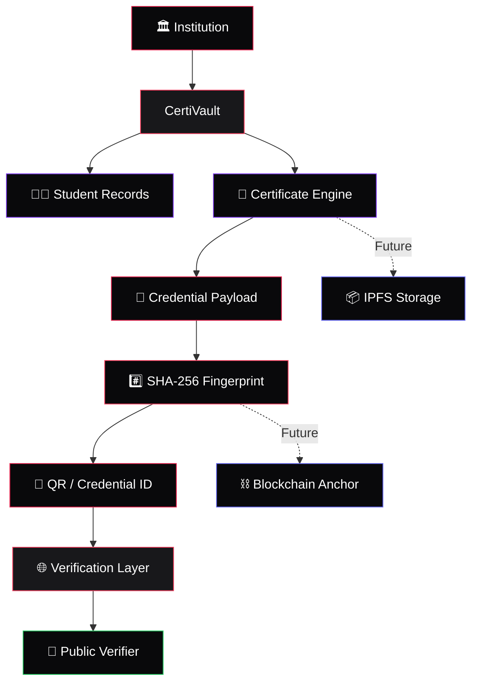
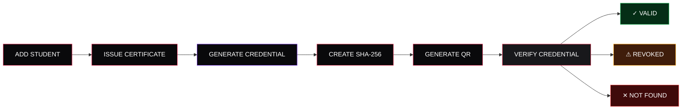

<div align="center">


<br/>


<br/><br/>

<a href="https://agent-6aaaa93f466ab10f535b20d--certivault-arijit.netlify.app">

</a>

  

<a href="https://github.com/Arijit07-tech7/CertiVault">

</a>

<br/><br/>


&nbsp;

&nbsp;


</div>

---

<div align="center">

# 🔐 CertiVault

### Digital Credential Trust Infrastructure

A secure digital platform for **issuing, managing and verifying academic credentials** with cryptographic integrity, QR-based verification and an architecture ready for blockchain anchoring.

<br/>

> **Issue securely. Verify instantly. Trust digitally.**

</div>

---

## 🚀 Live Application

<div align="center">

<a href="https://agent-6aaaa93f466ab10f535b20d--certivault-arijit.netlify.app">

</a>

<br/><br/>


</div>

---

## ✦ Why CertiVault?

Academic certificates are often distributed as static documents that can be difficult to authenticate quickly.

CertiVault introduces a digital credential lifecycle where certificates can be:

* **Issued** through a structured institutional workflow
* **Fingerprint-protected** using SHA-256
* **Connected** to a unique credential identity
* **Verified** using Credential ID or QR
* **Revoked** when necessary
* **Audited** through credential lifecycle events
* **Extended** toward blockchain and decentralized storage

The goal is simple:

**Make credentials easy to verify while keeping trust infrastructure behind the scenes.**

---

## 🔄 Credential Verification Flow


---

## ✨ Core Features

### 👨‍🎓 Student Management

Maintain structured student records containing:

**Name • Student ID • Department • Course • Batch • Email • Graduation Year**

### 📜 Certificate Issuance

Generate formal academic certificates from verified student information.

### 🔐 SHA-256 Fingerprinting

A deterministic cryptographic fingerprint can be generated from the credential data to help detect changes to the credential payload.

### 📱 QR Verification

A QR code can connect a physical certificate to its digital verification experience.

### 🔎 Instant Verification

A verifier can check a credential using its:

**Credential ID → QR → Verification Result**

### 🚫 Revocation

Issued credentials can be marked as revoked while preserving their credential identity and history.

### 🧾 Audit Trail

Credential operations can be tracked through structured audit events.

### 🖨️ Print & PDF

Certificates are designed for formal printing and digital sharing.

### ⛓️ Blockchain Ready

The architecture can be extended with blockchain anchoring without exposing blockchain complexity to normal users.

---

## 🛡️ Trust Architecture



---

## 🔏 Security Layer

<div align="center">


</div>

<br/>

**Cryptographic Integrity**
SHA-256 fingerprinting helps identify changes in credential data.

**Issuer Authorization**
Administrative operations should be protected through authenticated and role-based access.

**Revocation Registry**
Credentials can retain their identity even after being revoked.

**Audit Logging**
Important credential lifecycle operations can be recorded for accountability.

**Rate Limiting**
Verification endpoints can be protected against excessive automated requests.

**Secure Key Management**
Production private keys should remain server-side and be protected using secure key-management infrastructure.

> The current web deployment is a project implementation/demo. Production deployment would require a properly secured backend, database, authentication system and protected issuer keys.

---

## 📜 Certificate Experience

<div align="center">


<br/><br/>

**JIS GROUP**

### NARULA INSTITUTE OF TECHNOLOGY

<br/>

### CERTIFICATE OF ACHIEVEMENT

<br/>

This is to certify that

### **STUDENT NAME**

has successfully completed the prescribed academic requirements for the specified course and department.

<br/>

**Course • Department • Academic Year • Issue Date**

<br/>

**Authorized Signatories**

</div>

The technical fingerprint is intentionally kept behind the verification experience rather than being presented as a visible technical element on the printed certificate.

---

## 🔎 Verification States

<div align="center">

### 🟢 VERIFIED

The credential record exists and is currently valid.

<br/>

### 🟠 REVOKED

The credential exists but has been revoked by the issuing authority.

<br/>

### 🔴 NOT FOUND

No matching credential record was found.

</div>

---

## 🧩 Technology

<div align="center">


<br/><br/>

**Frontend**

React • JavaScript • Vite • CSS • React Router

<br/>

**Backend**

Node.js • Express • MongoDB • Mongoose

<br/>

**Security**

SHA-256 • Role Authorization • Rate Limiting • Audit Logging

<br/>

**Future Infrastructure**

Solidity • Blockchain Anchoring • IPFS • Secure Key Management

</div>

---

## 🏗️ System Architecture


---

## 📁 Project Structure

```text
CertiVault/
│
├── client/
│   ├── public/
│   │   ├── logos/
│   │   └── mascot/
│   └── src/
│       ├── components/
│       ├── pages/
│       ├── services/
│       ├── hooks/
│       ├── utils/
│       └── styles/
│
├── server/
│   └── src/
│       ├── controllers/
│       ├── models/
│       ├── routes/
│       ├── middleware/
│       └── services/
│
├── blockchain/
│   ├── contracts/
│   ├── scripts/
│   └── test/
│
├── certificates/
│   └── templates/
│
├── docs/
│
├── README.md
└── docker-compose.yml
```

---

## 🧪 Credential Lifecycle



---

## 🏏 Cricket Desk

<div align="center">


<br/><br/>

A lightweight cricket-themed assistant concept designed to make the dashboard more engaging.

<br/>

The assistant is a UI enhancement and remains separate from the core credential verification system.

</div>

---

## 🏛️ Institutional Context

<div align="center">

### JIS GROUP

## NARULA INSTITUTE OF TECHNOLOGY

**Information Technology**

<br/>

CertiVault is designed around the academic credential issuance and verification workflow of educational institutions.

<br/>

**Universities • Colleges • Training Institutes • Certification Organizations**

</div>

---

## 🔮 Future Vision


Potential future extensions include:

**Blockchain Anchoring • IPFS Storage • Institutional Authentication • Verifiable Credentials • Secure Key Management • Multi-Institution Networks**

---

## 👨‍💻 Developer

<div align="center">

### Arijit Gupta

**B.Tech — Information Technology**

**Narula Institute of Technology**

Kolkata, India 🇮🇳

<br/>

<a href="https://github.com/Arijit07-tech7">

</a>

<br/><br/>


</div>

---

<div align="center">


<br/>


<br/><br/>

### **CertiVault**

**Secure credentials. Clear verification. Digital trust.**

<br/>

React • Node.js • MongoDB • SHA-256

<br/><br/>

© 2026 CertiVault

</div>
